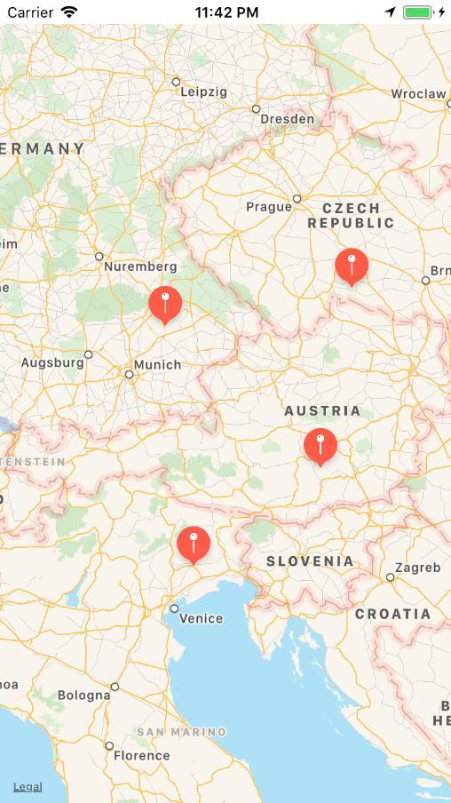
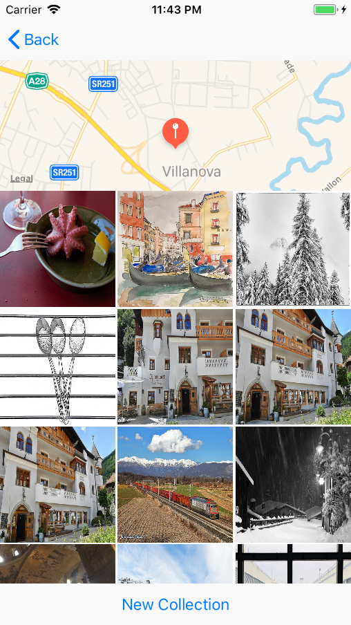
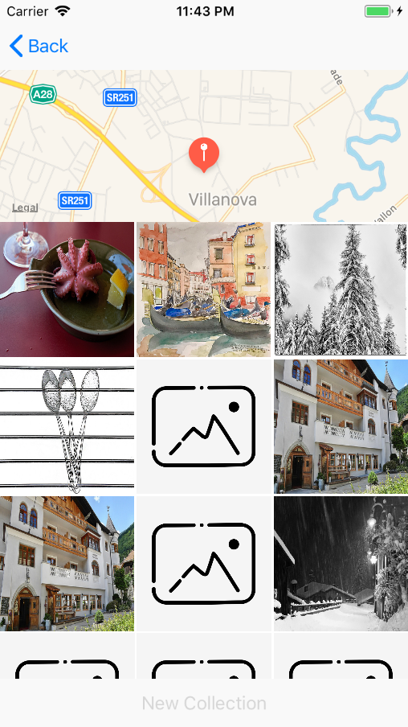

# Virtual Tourist (4/5)

This is the fourth part of a five part series of sample apps created for [Udacity's Nanodegree "Become an iOS Developer"](https://udacity.com/course/ios-developer-nanodegree--nd003).

With Virtual Tourist you can put pins on a _MapView_. If you tap on a pin, images that are associated with these coordinates are downloaded
from Flickr.

Learning focus of this app was to learn how to use __CoreData__. This includes:

* Creation of suited database models
* Persistence of data at relevant moments
* Migration of data models to a newer version.

## Screenshots
  

## Getting Started

These instructions will get you a copy of the project up and running on your local machine for development and testing purposes.

### Prerequisites

* XCode version that is capable of supporting Swift 4.0

## Built With

_There were no external libraries used for this project._

## Authors

* **Niklas Rammerstorfer** - *Initial work* - [Shanakor](https://github.com/Shanakor)
